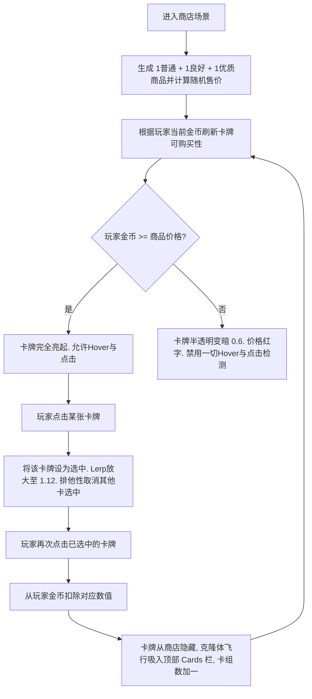

# 《卡牌控糖师》经济系统设计与数学模型分析文档

本篇文档旨在定义并分析《卡牌控糖师》游戏内的货币经济平衡体系。通过量化击败敌人获得的金币收益、卡牌的梯度定价、以及商店的购买力，为玩家提供兼具策略决策与心理博弈（“差一点金币就可以买下核心牌”的遗憾与爽感）的游戏体验。

---

## 1. 经济系统核心设计原则

1. **资源强控制**：金币只能通过击败敌人获得。初始金币固定为 `99`。
2. **两阶段商店定价标杆**：
   * **第一个商店（第 5 关）**：击败 4 名普通敌人后到达。玩家的预期金币应能购买 **1张优质卡**，或者 **1张普通卡 + 1张良好卡** 的组合。
   * **第二个商店（第 11 关）**：假设第一阶段的金币已在商店 1 全部花光，玩家在此阶段击败了 1 个 Boss 和 4 个普通敌人。到达商店 2 时积累的金币，应同样能够支撑购买 **1张优质卡**，或者 **1张普通卡 + 1张良好卡**。
3. **梯度定价与随机波动**：引入微小的随机扰动（Fluctuation），使得部分对局中玩家会由于运气或战斗决策“刚好差几枚金币”，从而刺激玩家后续更积极地争取完美通关或精打细算。

---

## 2. 经济系统数学平衡模型

### 2.1 阶段金币累积推导
定义：
* $G_{start}$ 为游戏开局金币 = $99$。
* $G_{normal}$ 为击败普通敌人的平均金币掉落。
* $G_{boss}$ 为击败 Boss 的平均金币掉落。

#### 阶段 1 (关卡 1 ~ 5):
在到达商店 1 之前，玩家击败了 4 个普通敌人。
$$\text{Expected Gold at Shop 1} = G_{start} + 4 \times G_{normal} = 99 + 4 \times G_{normal}$$

#### 阶段 2 (关卡 6 ~ 11):
假设在商店 1 消费后金币归零。在到达商店 2 之前，玩家击败了 1 个 Boss 和 4 个普通敌人。
$$\text{Expected Gold at Shop 2} = G_{boss} + 4 \times G_{normal}$$

#### 等式配平：
为了使两阶段在商店中的消费决策和体验完全一致，两个阶段积累的期望金币必须几乎相等：
$$99 + 4 \times G_{normal} \approx G_{boss} + 4 \times G_{normal} \implies G_{boss} \approx 99$$

这一数学关联极为契合，因此我们将 **Boss 金币掉落基准值** 设定为约 **100** 金币。

---

### 2.2 金币掉落与卡牌定价区间

结合上述数学平衡模型，设定如下具体参数值与波动范围：

| 项目 | 稀有度 / 类型 | 期望基准 (Base) | 随机范围 (Range) | 占期望金币比重 |
| :--- | :--- | :--- | :--- | :--- |
| **敌人金币掉落** | 普通敌人 | **30** | $30 \pm 4$ ($26 \sim 34$) | - |
| | Boss 级敌人 | **100** | $100 \pm 10$ ($90 \sim 110$) | - |
| **卡牌售价** | 普通卡牌 (Common) | **90** | $90 \pm 10$ ($80 \sim 100$) | 约 41% |
| | 良好卡牌 (Uncommon)| **130** | $130 \pm 15$ ($115 \sim 145$) | 约 59% |
| | 优质卡牌 (Rare) | **220** | $220 \pm 20$ ($200 \sim 240$) | 约 100% |

> [!TIP]
> 波动机制在代码中使用 `UnityEngine.Random.Range(min, maxInclusive)` 实现。
> 定价公式：
> - $\text{Common Card Price} = \text{Random.Range}(80, 101)$
> - $\text{Uncommon Card Price} = \text{Random.Range}(115, 146)$
> - $\text{Rare Card Price} = \text{Random.Range}(200, 241)$

---

## 3. 购买力与“恰好不足”概率学分析

在平均运气的基准下：
* 阶段 1 累积金币平均为：$99 + 4 \times 30 = \mathbf{219}$ 金币。
* 阶段 2 累积金币平均为：$100 + 4 \times 30 = \mathbf{220}$ 金币。
* 购买 **1张优质卡** 期望花费：$\mathbf{220}$ 金币。
* 购买 **1张普通卡 + 1张良好卡** 期望花费：$90 + 130 = \mathbf{220}$ 金币。

通过微小波动的叠加，我们将制造出以下几种极为有趣的对局边界状态：

### 案例 A：非酋状态（金币刚好差一点点）
* **玩家金币掉落偏低**：击败 4 名普通敌人，分别掉落 $26, 27, 26, 28$ 金币，总共获得 $107$ 金币。加上初始 $99$，共 **206** 金币。
* **商店卡牌售价偏高**：优质卡（Rare）定价随机到了 **225** 金币。
* **冲突表现**：此时玩家看到核心优质卡极其心动，但金币却卡在 $206/225$（**只差 19 金币**！）。此时商店会将该优质卡**置灰并禁用交互**，迫使玩家不得不买一张普通或良好卡。这种差之厘毫的体验极具Roguelike重玩吸引力。

### 案例 B：欧皇状态（完美双买）
* **玩家金币掉落偏高**：普通敌人全部掉落 $33, 34, 34, 32$ 金币，加上初始共积攒了 **232** 金币。
* **商店折算低价**：普通卡随机定价到 **82** 金币，良好卡随机到 **118** 金币（总计 **200** 金币）。
* **冲突表现**：玩家手头有 $232$ 金币，不仅能成功买下这两张卡，还能富余 $32$ 金币带入下一阶段。

---

## 4. 商店交互设计与状态流转

为了实现流畅的游戏体验并杜绝误触Bug，商店购买流程设计为**“双击确认购买，余额不足禁用”**，整体状态流转如下：

### 4.1 详细交互规则
1. **卡牌与金币的整体悬停 (Hover)**：
   * 金币显示框 (`GoldValue`) 挂载为卡牌预制体的子物体。当卡牌被鼠标悬停触发 Lerp 放大至 `1.06` 倍时，金币框会作为子节点自动实现一致的同步放大，视觉表现高度协调统一。
2. **排他性单选 (Selection)**：
   * 点击任意买得起的卡牌，该卡牌进入“准备购买”状态，并 Lerp 放大到 `1.12` 倍保持，同时使之前选中的商品复位缩回。
3. **去确认按钮的直接双击购买 (Double-Click Purchase)**：
   * 当玩家再次点击处于“准备购买”状态的卡牌时，直接触发交易。
   * 交易完成时，卡牌自身隐藏，克隆体去除交互组件并飞入顶部牌组，其余卡牌在原位保持，可继续购买。
4. **实时刷新置灰与射线穿透屏蔽 (Affordability Update)**：
   * 每次购买成功扣款后，商店会自动调用一次 `UpdateCardAffordability()`，根据最新剩余金币刷新其它两张卡的显示状态。
   * 原本买得起的卡如果由于余额扣减变得买不起了，会立刻触发置灰变暗、金币改红字，并设置 `CanvasGroup.blocksRaycasts = false` 来彻底屏蔽 hover 和点击事件，确保逻辑 100% 安全。
