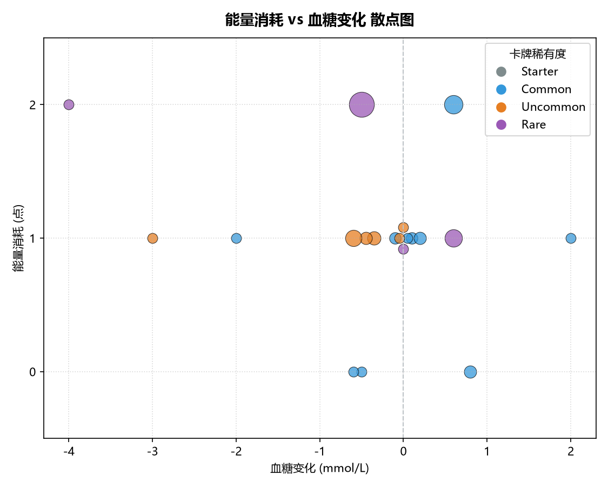
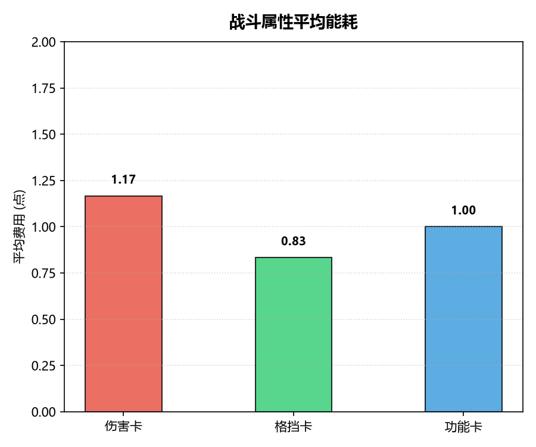
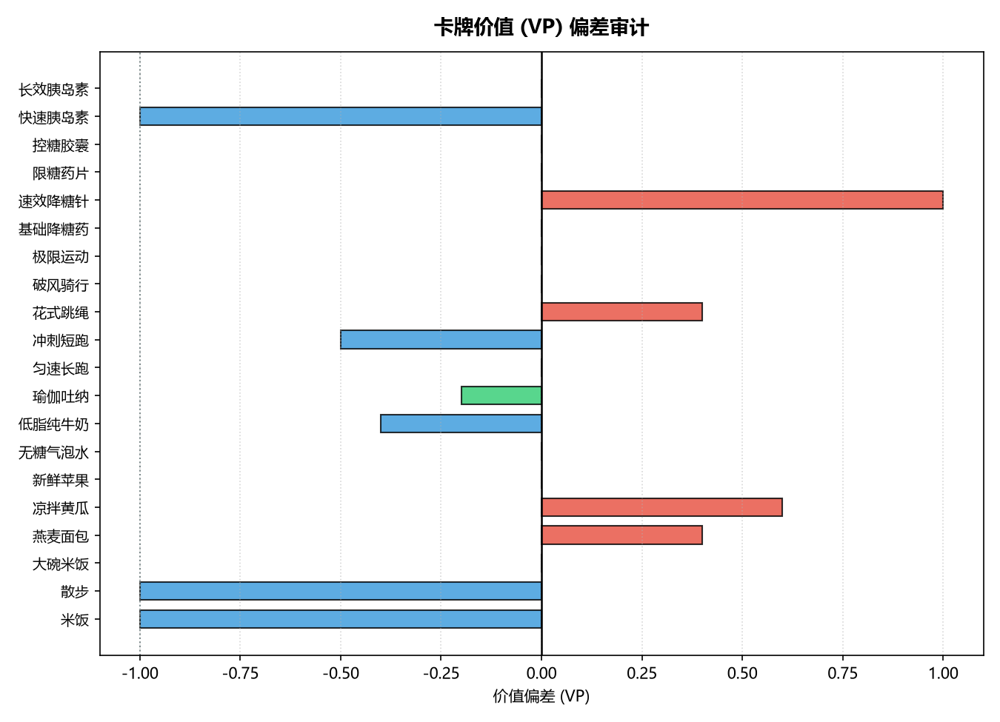
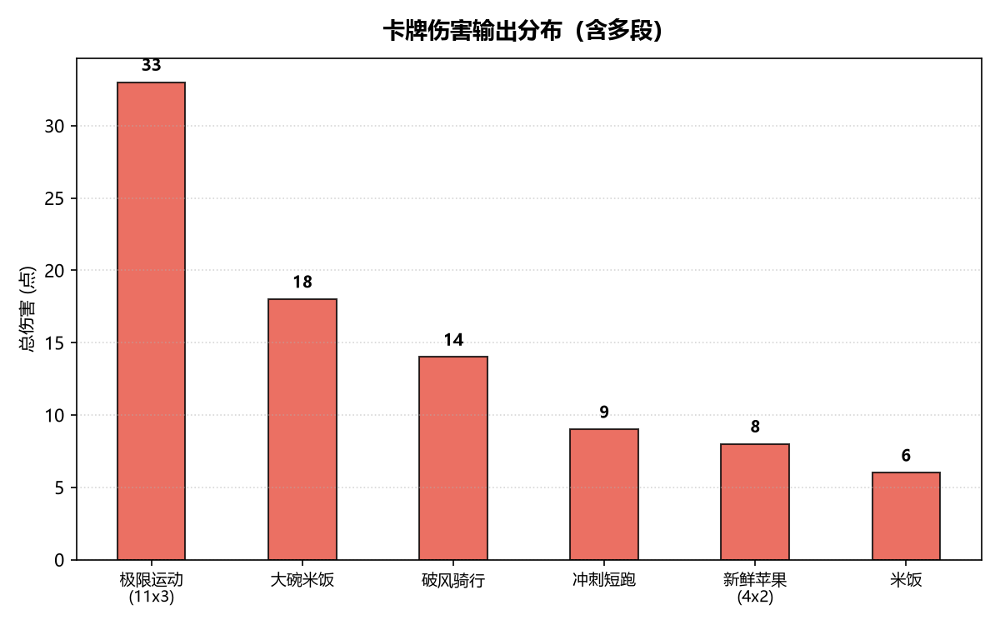
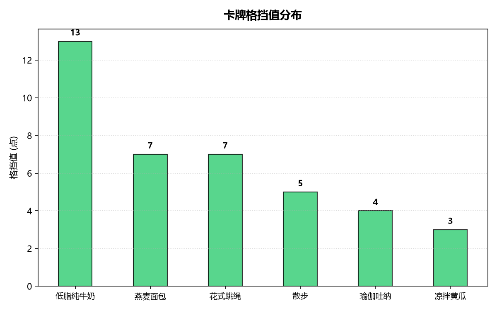
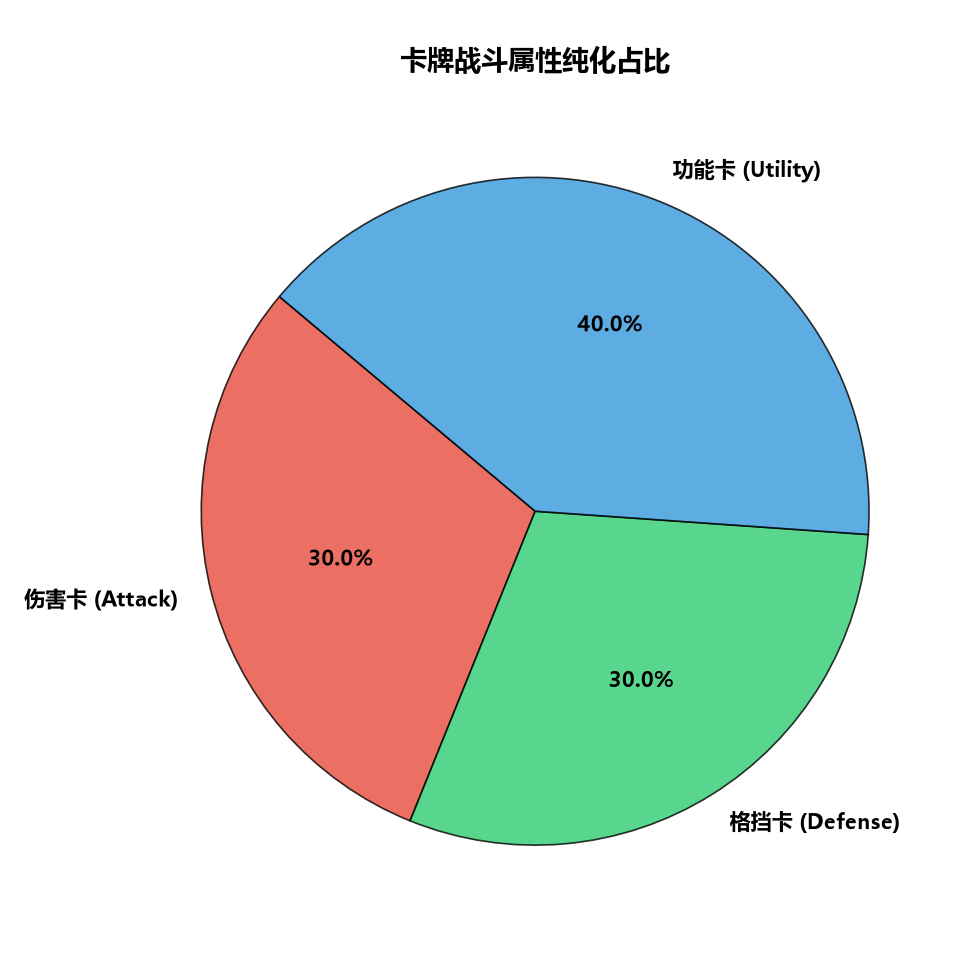
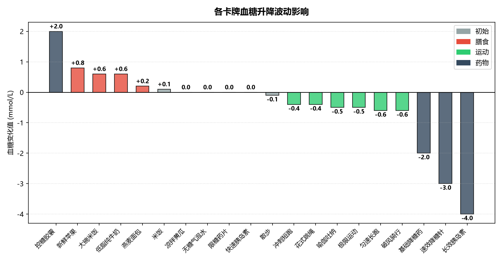

# 《卡牌控糖师》数值配平审计指南

为了让策划更直观地监控卡牌平衡性，本项目提供了一个自动化的数值审计与图表可视化脚本。建议使用独立的 Python 虚拟环境运行此脚本。

---

## 一、 配平工具环境准备

为避免依赖版本冲突，强烈建议在项目根目录下配置虚拟环境（Virtual Environment）：

### 1. 初始化虚拟环境 (Windows PowerShell)
在项目根目录下打开终端，执行以下命令创建并激活虚拟环境：

```powershell
# 创建虚拟环境（一般在根目录下生成 .venv 文件夹）
python -m venv .venv

# 激活虚拟环境 (Windows PowerShell)
.venv\Scripts\Activate.ps1

# 激活虚拟环境 (Windows CMD)
.venv\Scripts\activate.bat
```

### 2. 安装脚本依赖
激活虚拟环境后，通过 `scripts/requirements.txt` 一键安装绘图依赖库：

```bash
pip install -r scripts/requirements.txt
```

---

## 二、 运行自动化配平工具

激活虚拟环境后，直接在根目录下执行审计脚本：

```bash
python scripts/audit_and_visualize.py
```

执行后，脚本将自动完成：
1. 读取卡牌源数据 `data/initial_cards_data.csv`。
2. 按照天平公式自动校验每张卡牌的数值，并在终端输出详细的**《数值平衡配平审计账单》**与**《战斗属性平均能耗统计》**。
3. 渲染出 7 张独立的平衡与分布分析图表，保存路径为：[docs/assets/](./assets)。

---

## 三、 数值配平图表解读

自动化校验生成的 7 张高清图表能够全方位覆盖卡牌数值审计的不同维度：

### 1. 能量消耗 vs 血糖变化 散点图

* **读图方式**：
  * 横轴代表血糖变化（左侧降糖，右侧升糖），纵轴代表能量消耗（底端为0费，顶端为2费）。
  * 散点的大小代表该卡牌的**理论价值点数（Target VP）**。
  * 圆点颜色代表卡牌稀有度（灰色为初始，蓝色为普通，橙色为良好，紫色为优秀）。
  * **【径向防重叠设计】**：对坐标完全相同的多张卡牌，脚本会自动将它们的圆点向外环形散开（Jitter），以防圆点完全重合。为了保持图表整洁、防止文字重叠，图中去除了卡牌名称标注。
* **设计意图**：检查卡牌在坐标系中的空间分布。如果大量高升糖卡牌堆积在0费，或者大额降糖卡牌堆积在2费，代表代谢节奏可能失控。

### 2. 战斗属性平均能耗

* **读图方式**：柱状图展示了 伤害卡 (Attack)、格挡卡 (Defense)、功能卡 (Utility) 的平均费用。
* **设计意图**：控制伤害、格挡、功能卡牌的均费曲线，以确保出牌连贯性。目前伤害卡均费控制在 **1.17 费**（平滑好用），格挡卡均费控制在 **0.83 费**（利于防守），功能卡均费控制在 **1.00 费**，避免费用结构臃肿。

### 3. 卡牌价值偏差审计

* **读图方式**：横向条形图展示了每一张卡牌的实际设计数值与天平公式折算值的**偏差（Deviation）**。
  * **绿色（±0.3以内）**：代表卡牌完美配平。
  * **蓝色（<-0.3）**：代表卡牌被故意削弱，或者数值分配保守。例如初始卡【米饭】和【散步】由于是玩家开局必带卡，我们特意做了 **-1.0 VP** 的削弱设计，以拉开与后续拿到卡牌的梯度。
  * **红色（>0.3）**：代表卡牌超模（超出 VP 预算），需要警惕。
* **设计意图**：一键锁定数值超常的破坏性卡牌。

### 4. 卡牌伤害输出分布

* **读图方式**：展示所有能够造成伤害的卡牌的总伤害额度（多段攻击已自动折算为总伤害）。
* **设计意图**：直观对比攻击卡牌的伤害强度是否呈现出递增的合理阶梯（如初始卡伤害低，普通卡居中，自残的【极限运动】位于爆发顶点）。

### 5. 卡牌格挡值分布

* **读图方式**：展示所有防御卡牌提供的格挡值。
* **设计意图**：确认格挡厚度梯度是否合理，防范低费防御卡过度提供盾量的问题。

### 6. 卡牌战斗属性纯化占比

* **读图方式**：展示纯伤害卡、纯格挡卡和纯功能（Utility）卡牌的占比比例。
* **设计意图**：落实“无攻防混杂卡”的卡牌纯化要求，确保卡牌功能单一，目前攻防卡各占 30%，功能卡占 40%，实现完美的战术平衡。

### 7. 各卡牌血糖升降波动影响

* **读图方式**：按血糖变化值降序排列，升糖值显示为正值柱体（红色），降糖值显示为负值柱体（绿色/蓝色）。
* **设计意图**：审计单个卡牌的瞬时糖负荷。如果某张膳食卡的升糖值超出合理限制，或者运动卡降糖效果偏离严重，可通过此图一眼辨识。

---

## 四、 导出与版本规范

1. **导出更新**：若在 Master 电子表格中调整了卡牌属性，请重新另存为 CSV 格式并替换 `data/initial_cards_data.csv`。
2. **校验提交**：提交 Git 仓库前，**必须本地激活虚拟环境并运行** `scripts/audit_and_visualize.py`，确保没有非预期的红色超模条。
3. **提交规范**：运行完本脚本后，如果图片数据发生变化，生成的 7 张 PNG 图表文件需要随同修改后的 `data/initial_cards_data.csv` 一起打包提交，Git 提交信息前缀使用 `design:`。
