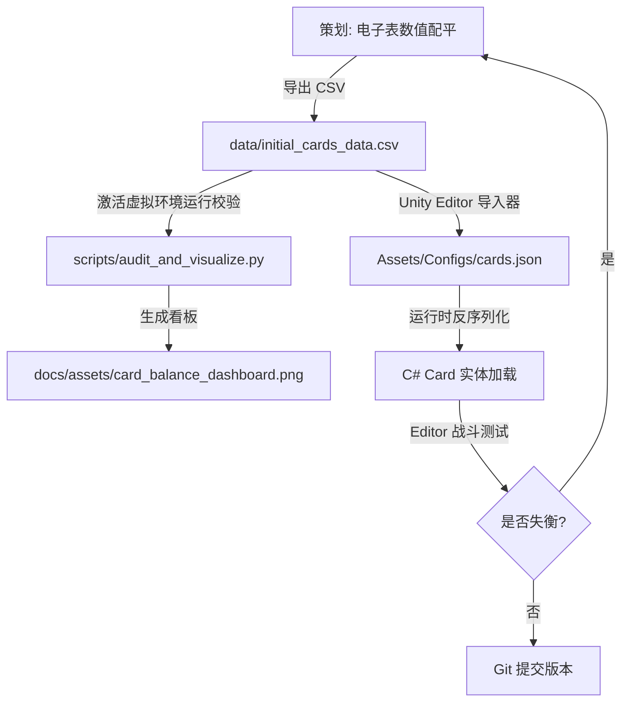

# 《卡牌控糖师》项目开发标准作业程序 (SOP)

本标准作业程序（SOP）定义了《卡牌控糖师（Card Glucose Master）》项目的数值配平、程序读取、游戏测试以及版本提交的工作流，旨在规范协作并提高开发迭代效率。

---

## 一、 开发闭环流向

---

## 二、 数值设计与配平规范

### 1. 配平工作流与虚拟环境
* 策划必须使用母表（Master Excel）进行数值维护。具体配平工具说明与图表解读请参考 [docs/guide_balance_audit.md](./guide_balance_audit.md)。
* 单卡配平必须严格遵守 [docs/design_card_formula.md](./design_card_formula.md) 的价值点数（VP）规则。若为特定卡牌微调（如 starter 卡 nerf），需在表格偏差（diff）中体现并注明理由。
* **虚拟环境规范**：为避免团队环境不一致，脚本开发及运行必须基于独立的 Python 虚拟环境。在 `scripts/requirements.txt` 中配置对应依赖。

### 2. 导出与集成规范
* 严禁直接在 Unity 中或代码中硬编码卡牌战斗数值（伤害、格挡、血糖变化等）。
* 数值调整完成后，必须在 Excel 中另存为 **CSV 逗号分隔格式**，字符集采用 **UTF-8**。
* 覆盖保存路径为：`data/initial_cards_data.csv`。
* **提交流程前置**：在提交 Git 仓库前，**必须激活虚拟环境并运行一次** `scripts/audit_and_visualize.py` 脚本，确保数值符合天平规范，并将生成的 `docs/assets/card_balance_dashboard.png` 看板图表与 CSV 文件一并暂存提交。

---

## 三、 Unity 资产与程序管线

### 1. 目录规范
* 配置文件存放于：`Assets/Configs/`。
* 脚本核心存放于：`Assets/Scripts/`。
  * `Core/`：血糖管理器、战斗逻辑、状态结算。
  * `Data/`：数据定义（C# 类定义）与配置解析器。
  * `UI/`：界面渲染与伤害动效。

### 2. 数据转化与读取
* **自动化管线**：程序需编写 Unity Editor 脚本，在 Editor 文件夹下监听 `data/initial_cards_data.csv` 的改动。当 CSV 更新时，自动转换并生成编译好的 `Assets/Configs/cards.json`。
* **反序列化规则**：卡牌类只在初始化时读取 JSON。运行时所有的伤害和防御计算必须以读取出的 `finalDamage` 与 `finalBlock` 为基准值，不允许在逻辑代码中动态演算 VP 公式，保证数值策划的绝对调整权。

---

## 四、 实机调试与测试闭环

### 1. 热重载机制
* 游戏必须支持热重载（可在 Editor 模式下运行战斗时，点击 UI 上的 `Reload` 按钮重新加载 `cards.json` 数据并立即应用到当前战斗中），从而免去反复退出、进入 PlayMode 的时间消耗。

### 2. 测试验收指标
在 PlayMode 实机中评估数值合理性时，遵循以下验收基准：
* **生存极限指标**：使用默认牌组，在不吃药情况下，玩家血糖在健康区间 $(4.4 \sim 7.0)$ 维持的回合数中位数应在 $3 \sim 5$ 回合。若低于 2 回合，说明基础升降糖数值偏差过大。
* **惩罚性心流**：高血糖状态（>7.0）下，膳食/运动的血糖变化翻倍惩罚，应能产生明显的出牌停顿思考（不能盲目吃高碳水）。
* **0 费爆发性**：测试手牌中刷出多张 0 费卡时，单回合出牌上限是否因过牌过多而卡死（手牌上限 10 张，避免爆牌）。

---

## 五、 版本管理与 Git 提交规范

### 1. 提交前检查
1. 确保 Unity 编辑器已保存当前正在编辑的 Scene 和 Prefab，防止资产状态丢失。
2. 确保没有因测试产生多余的临时日志或本地文件被意外追踪。
3. 检查 `.meta` 文件是否与其对应的资产文件（如 `.csv` 对应 `.csv.meta`）一并打包暂存。

### 2. 提交消息前缀
* `feat:` 开发新系统、新状态机制或 UI 渲染代码。
* `fix:` 修复逻辑漏洞、卡牌效果结算错误或编译器报错。
* `design:` **专属前缀，用于数值配平调整**（如修改 `data/initial_cards_data.csv` 里的伤害、能耗或血糖数值）。
* `chore:` 调整 `.gitignore`、修改文档、包管理器更新等。
* 示例：`design: nerf starter cards block and damage in csv`
